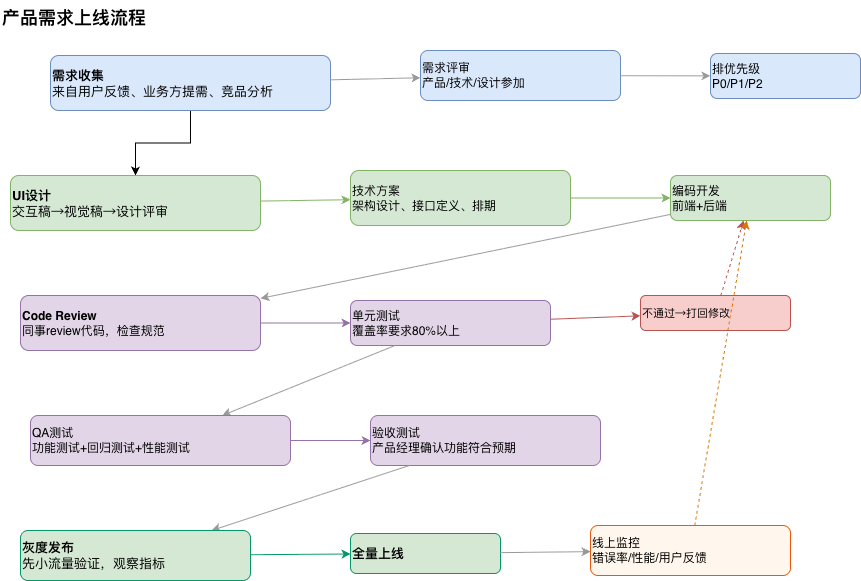
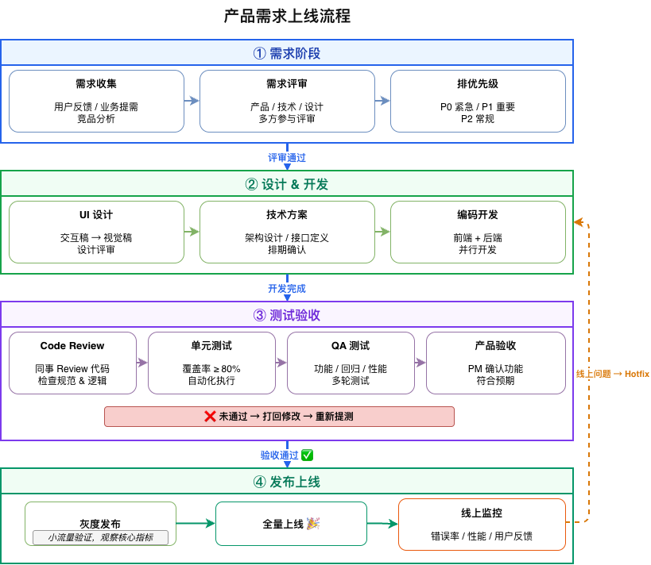

# drawio-flowchart

一个 [AgentSkill](https://agentskills.io)，教 AI Agent 生成**高质量的 draw.io 流程图**——布局整齐、层次分明、风格统一。

> 🧩 兼容 [OpenClaw](https://github.com/openclaw/openclaw)、[Claude](https://claude.ai) 及所有 AgentSkills 兼容平台。

## 效果对比

没有这个 Skill 时，AI 生成的流程图通常：
- ❌ 节点散落，没有分组容器
- ❌ 文字左对齐，字号大小不分层
- ❌ 箭头细灰，主次流程不区分
- ❌ 画布过宽导致自动缩放，文字看不清
- ❌ 回退箭头斜穿画面

有了这个 Skill：
- ✅ Swimlane 容器按阶段分组
- ✅ 文字居中，三级字号层次（16/13/12px）
- ✅ 阶段配色 + 粗蓝主流程箭头
- ✅ 画布 ≤ 800px，不缩放，字体清晰可读
- ✅ 正交箭头走线，回退箭头走左侧边距

| Before（无 Skill） | After（有 Skill） |
|--------|-------|
|  |  |

## 安装

### OpenClaw（推荐）

```bash
# 通过 ClawHub 安装
clawhub install drawio-flowchart

# 或直接 clone 到 workspace
git clone https://github.com/YOUR_USERNAME/drawio-flowchart.git ~/.openclaw/workspace/skills/drawio-flowchart
```

### 其他 AgentSkills 兼容工具

将整个 skill 文件夹复制到你的 Agent skill 目录即可。Agent 会读取 `SKILL.md` 获取所有指令。

## 目录结构

```
drawio-flowchart/
├── SKILL.md                  ← 核心文件（全部设计规范）
├── references/
│   └── template.md           ← XML 骨架模板 + 常用模式
├── assets/
│   ├── before.png            ← 对比图：无 Skill
│   ├── after.png             ← 对比图：有 Skill
│   ├── demo-flow-before.drawio  ← 对比用 drawio 源文件
│   └── demo-flow-after.drawio   ← 对比用 drawio 源文件
├── README.md                 ← 本文件
├── LICENSE                   ← MIT 开源协议
└── .gitignore
```

## 核心设计规则

完整规范在 `SKILL.md` 中，以下是关键规则：

| 规则 | 为什么 |
|------|--------|
| `pageWidth ≤ 800` | 防止 diagrams.net 自动缩放导致文字极小 |
| Swimlane 容器 | 提供阶段分组 + 内置标题栏 |
| 三级文字：16 → 13 → 12px | 清晰的视觉层次 |
| 全部 `align=center` | 整洁、专业的视觉效果 |
| 阶段间箭头：3px 蓝色粗线 | 区分主流程和内部连接 |
| 五色调色板 | 统一的阶段辨识度 |
| 仅正交箭头 | 杜绝斜线和交叉 |
| `<mxfile>` 外层包裹 | 兼容桌面版和网页版 |

## 输出方式

Skill 会指导 Agent：
1. 生成完整的 `.drawio` XML 文件并保存到本地
2. 告诉用户打开方式：
   - **网页版**：打开 https://app.diagrams.net → 选择「Open Existing Diagram」
   - **拖拽**：将文件拖入已打开的 diagrams.net 页面
   - **桌面版**：安装了 diagrams.net 桌面版或 VS Code draw.io 插件，直接双击打开

## 使用示例

> "画一个产品需求上线流程图：需求收集 → 设计 → 开发 → 测试 → 灰度 → 全量上线"

Agent 会按照所有设计规范生成一个结构清晰的 `.drawio` 文件。

## 贡献

欢迎提 PR！如果你发现布局边界情况或想增加更多模式（如并行泳道、时间线图），欢迎贡献。

## 开源协议

MIT
